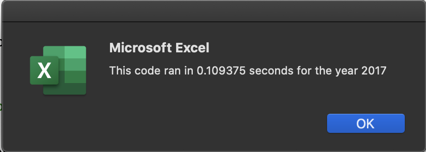
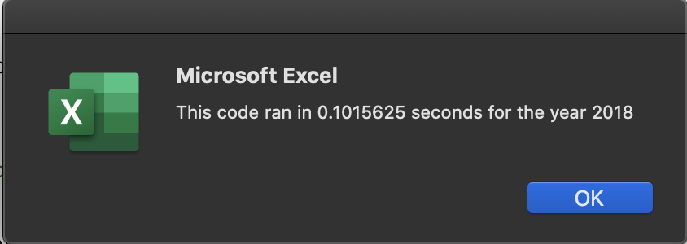

# **Stock-analysis**
- Analysis of Stock Market data using code written in Visual Basic for Applications(VBA) providing extensibility to Microsoft Excel.
---
## Overview of the Project
- Steve, a fresh college grad, wants to leverage his education to help his parents by analysing stock market data and suggesting right investments. Though he is good at Excel and its formulae, he wants to automate the tasks using Visual Basic for Applications (VBA) which is often used in finance industry. VBA provides essentially infinite extensibility to Excel. Using code to automate tasks decreases the chance of errors and reduces the time needed to run analysis, especially if they need to be done repeatedly.
- The complete analysis of the stock market dataset can be downloaded and viewed in the Macro enabled MS excel file hyperlinked as "Stock-Analysis file" here : 
<a href="https://github.com/VinuthaBS/Stock-analysis/blob/main/VBA_Challenge.xlsm">------> Stock-Analysis file</a>

## **Results**
- In the "All Stocks Analysis" worksheet of the macro enabled MS excel file, clicking on the "Analyse All stocks with refactored code" button, takes the input year as 2017 or 2018 from the user and runs the analysis on stock data corresponding to the selected year.
- During the year 2017, except for 1 stock (TERP) return for all others are positive. Overall, for dataset in consideration, 2017 seems to be a very good year in terms of Return and also Total Daily Volume.
- During the year 2018, only 2 stocks(ENPH and RUN) had positive performance but rest all had negative performance which means that they were not worthy enough to be invested in. If at all, has to be invested will have to pick either ENPH or RUN based only on 2018 return. 
- ENPH : if we consider consistency in the performance between 2017 and 2018 "ENPH" has remained lot more consistent in terms of positive returns and also Total Daily Volume. 2018 being a bad year for most of the stocks, ENPH seems to have performed pretty well against all odds as the drop in return from 2017 to 2018 is not as bad as any other stock.
- RUN : Though 2017 returns was just a positive with 5.5%, this stock seems to be outperforming all other stocks in 2018 giving a return of 84%. Even the total daily volume has doubled. Hence the results indicate that RUN can be expected to grow with the same momentum in the coming years.
- The analysis that helped us to arrive at above conclusions on stocks data of 2 different years (dealing with data of around 3000+rows) were obtained in fraction of a second. "0.6secs" to be precise.
- Furthermore, refactoring of the same code increased the efficiency by taking fewer steps and reduced the execution time to "0.1sec" for both 2017 and 2018 dataset as shown in the screenshots below. To be specific, the piece of code which helped us achieve this efficiency is having outputs read into 3 different arrays and not having nested "for" loop which made the code to go through 3000rows of data only once.

</img>
</img>

## **Summary**
 - Refactoring comes into picture, when one wants to expand the dataset to include the entire stock market over the last few years. When the dataset increases heavily, code might not work as well for thousands of stocks or even if it does, it may take a long time to execute. To handle such issues, code is revisited and Refactored to make the code more efficient—by taking fewer steps, using less memory, or improving the logic of the code to make it easier for future users to read.
 - Refactoring is an effort in itself. Time and effort needs to be allocated to revisit the working piece of code which can even backfire and there can be chances of breakages in a once very well working code. Also as there is no new functionality introduced during refactoring it might be an effort very less appreciated due to no noticeable deliverables.
 - To be specific on the above stock analysis example, without refactoring, the code went through the 3000rows of data for all 12 iterations of tickers. This took up major amount of the time and hence execution time was almost 0.6s. If the dataset is increased, then the execution time could have increased manifolds.
 - While refactoring, this unnecessary looping through all 3000rows of data 12 times was removed. 3 arrays collected the desired data while running through the 3000rows of data only ONCE. This reduced the execution time to just 0.1s which is a major, significant performance improvement and a major step towards efficiency. 
 - The dataset considered is completely sorted in ascending order and grouped by tickers. Hence the refactoring solution was applicable. Incase the data was not sorted or random, we had to look for sorting the data first or change the refactoring solution entirely.